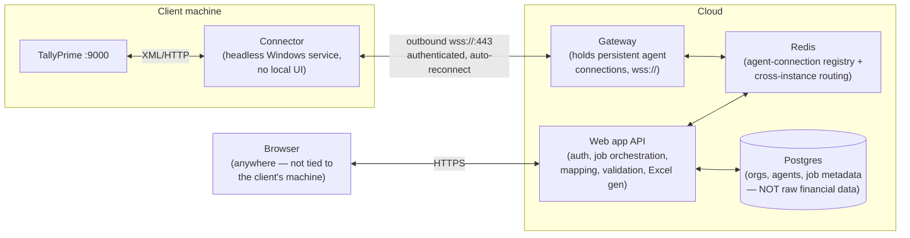

# Target architecture (decided)

Companion to [zoho-migration-tool-review.md](zoho-migration-tool-review.md), which documents the manual process we're replacing, and [deployment-plan.md](deployment-plan.md), which turns the phases below into an actual dev → staging → production build order on AWS.

**Revision note:** an earlier version of this doc decided on a *local-first* design (hosted panel UI, but the browser called the connector directly over `localhost`, so the connector never needed to accept inbound traffic). That's been superseded — the requirement is now for the web application to be the single, central place a user interacts with, reachable from anywhere, with the connector as a headless background agent and no local UI at all. That requires a cloud tunnel. This doc now records that decision. The local-first design is kept at the bottom for reference, since it's a legitimate fallback if the tunnel's operational cost ever isn't worth it.

**Scope for v1 (decided, unchanged):** automate everything up to a validated, Zoho-Books-import-ready Excel/CSV file the user downloads. The final manual CSV import into Zoho Books and the closing-balance check stay human steps — but everything before that (Tally export settings, JDK install, file copying, running a silent batch job, hand-auditing an integrity CSV) becomes one flow in the web application. Direct Zoho Books API push is still out of scope for v1.

---

## Components

The connector reuses the existing `TallyModule` almost unchanged (`EnvelopeBuilder` → `TallyHttpClient` → `TallyResponseParser` → typed JSON) — that's exactly why it was built as a self-contained module in Phase 1. What changes is the transport it's driven by: instead of exposing these as local HTTP endpoints for a browser, it becomes a command handler that receives "run this extraction" messages over the tunnel and streams typed JSON results back. No mapping, validation, or Excel logic runs on the client machine at all.

## The two decisions this design is built around

1. **Processing happens in the cloud, not on the agent.** The agent only extracts and forwards typed Tally data (companies/ledgers/vouchers/etc., using the parser already built and tested). Mapping rules, validation, and Excel generation live in the API layer. This means a mapping-rule fix ships instantly to every client with zero agent redeployment — the tradeoff is that raw financial data does transit your infrastructure in-flight.
2. **That data is transient, not persisted.** Extracted records exist in memory/stream for the duration of a job, get turned into the output file, and are discarded. What *is* persisted is job **metadata** — org, agent, company, which entity types were requested, record counts, validation-issue counts, status, timestamps (this is exactly what `ExtractionJob` already models). The generated Excel file itself should live in short-TTL storage (e.g. object storage with a lifecycle rule, or streamed straight through without touching disk) — not kept indefinitely. If "re-download without re-extracting" turns out to be a real need later, that's a deliberate follow-up decision (it reopens retention/compliance questions), not a default.

## Non-negotiables for this architecture

**Connectivity & resilience**
- `wss://` on port 443 with configurable outbound proxy support — client networks routinely block non-standard ports and force traffic through an authenticated forward proxy.
- Reconnect with backoff; "agent offline" is a normal, frequent state (sleep, reboot, WiFi drop), not an error condition.
- Three independent status signals surfaced to the web app, not conflated: **agent online** (tunnel up) / **Tally reachable** (agent can hit :9000) / **company loaded** (target company open in Tally). Each fails differently and needs a different fix.
- Jobs, not request/response — an extraction crossing a network hop needs to survive a tunnel drop mid-job (clean failure + resumability), and the browser needs push/poll status rather than holding an HTTP connection open across a whole extraction.

**Multi-tenancy & routing**
- A given agent's socket lives in one gateway instance's memory; scaling the gateway horizontally requires a shared registry (Redis) so any API instance can find and route to the right gateway instance. This is not optional once there's more than one gateway process.
- `TallyConnection` (currently an unused entity) becomes the real agent registry: org → agent(s) → live status → paired companies. `DatabaseModule` (currently a stub) and `ExtractionJob`'s repository (currently hardcoded to persist nothing) need to become real before any of this works.

**Security — the threat model changed**
- Local-first's threat model was "another browser tab on the same PC." This one's threat model is the public internet. Agents authenticate with a per-install device credential issued at download/pairing time and scoped to one org — never a bare origin check.
- Least privilege: an agent can only ever act on the org/company it's paired to.
- Revocation: killing one compromised/lost agent's access must not require a redeploy.
- Per-agent rate limiting, TLS everywhere including the tunnel itself.

**Versioning**
- The agent now lives on client machines you don't control day-to-day. It must report its version on connect; the gateway should flag or block outdated agents rather than silently running stale mapping logic.

## Phased build plan

### Phase 1 — Agent tunnel client
Replace the connector's local HTTP controller with a tunnel client: connects outbound to the gateway, authenticates, and handles "extract X for company Y" commands by driving the existing `TallyService`/`EnvelopeBuilder`/`TallyResponseParser` and streaming results back. Reconnect/backoff, proxy support, version reporting.

### Phase 2 — Gateway service
New cloud component: terminates agent WebSocket connections, authenticates them, and routes API requests to the correct agent via Redis so it works across multiple gateway instances.

### Phase 3 — Agent registry & pairing
Make `TallyConnection` real: per-org device credentials issued at download time, pairing flow, revocation, live status tracked in Postgres.

### Phase 4 — Job orchestration
Make `ExtractionJob` real (currently a no-op stub — see [tally.module.ts](../src/tally/tally.module.ts)), backed by **BullMQ** on the existing Redis instance: async job lifecycle, status push/poll to the browser, short-TTL storage for the generated file, no persistence of raw extracted records. On completion (or on an agent going unexpectedly offline mid-job), send a **Nodemailer**-based notification rather than requiring the user to keep the panel tab open and watch.

### Phase 5 — Master & transaction data breadth
Same entity list as before — only `Ledger` is modeled end-to-end today. Priority: Stock Items and the core voucher types (Sales/Purchase/Payment/Receipt/Journal) first; the long tail (Branches, Composite Items, Transfer Orders, TDS/TCS conf) later. Mechanical, low-risk — same pattern as the existing `Ledger` implementation.

### Phase 6 — Mapping & validation engine
Port the reference tool's voucher-type mapping and the accounting edge-case rules (from the Pre-Migration Checklist) as versioned, tested code in the API layer — this is real, necessary complexity, now centralized instead of duplicated across client installs. Build the `Integrity.csv` equivalent as structured validation results shown inline before download.

### Phase 7 — Excel/CSV writer
`exceljs`-based generator matching Zoho Books' exact import-template shape, run in the API layer against the data streamed up from the agent.

### Phase 8 — Web app UI
A React frontend: org/agent management, live 3-state connection status, company picker, extraction flow with real-time job progress (polling or a WebSocket subscription to the BullMQ job status), inline validation warnings, download.

---

## Appendix: the superseded local-first design

Kept for reference — this is the simpler fallback if a full tunnel infrastructure ever isn't worth the operational cost (no gateway, no Redis routing, no device-credential system, no ephemeral-storage/retention questions, data never leaves the client machine). It assumed the operator's browser was always on the same machine as the connector (present or remoted in), so the panel UI could call `localhost:3000` directly with no inbound tunnel needed — just CORS-origin-locking, a Private Network Access response header, and a local pairing token. Superseded because the requirement is now remote access from anywhere, not just from the client's machine.
