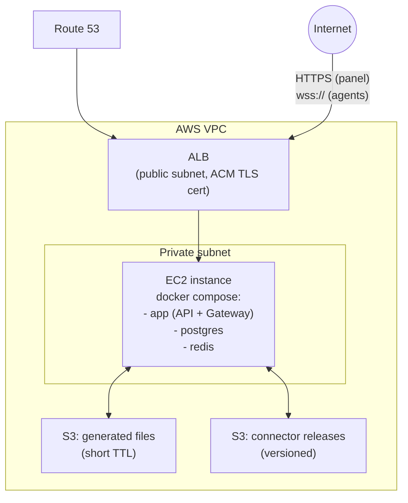

# Deployment plan: dev → staging → production on AWS

Companion to [architecture.md](architecture.md) (what the system is) and [zoho-migration-tool-review.md](zoho-migration-tool-review.md) (what we're replacing). This doc answers the operational question: **which service runs where, what does it own, and in what order do we actually build and ship this.**

**Decided:** AWS, deployed via Docker Compose on EC2 (not ECS/Fargate, not Kubernetes) — AWS-managed networking (VPC/ALB/Route 53) and storage (S3) around a small number of self-managed containers. This matches the project's existing pattern ([docker-compose.yml](../docker-compose.yml) already runs Postgres + Redis this way for local dev) and is the right amount of infrastructure for current scale — reaching for ECS/K8s now would be solving a scaling problem you don't have yet.

---

## 1. Service inventory — what exists, what it owns, where it runs

| Service | What it is | What it owns / holds | Where it runs |
|---|---|---|---|
| **App** | This repo's NestJS backend, extended | HTTP API for the panel (auth, org/agent management, mapping, validation, Excel generation) **and** the WebSocket gateway for agent tunnels — same process for v1 (see §2 for why) | Docker container on the EC2 host |
| **Postgres** (via Prisma) | Relational DB | Orgs, users, agents (`TallyConnection`, made real), job metadata (`ExtractionJob`, made real) — **never raw financial data** (see [architecture.md](architecture.md#the-two-decisions-this-design-is-built-around)) | Docker container on the EC2 host, data on an EBS volume |
| **Redis** | In-memory store | Cache (companies list, as today) + the **BullMQ** queue backing extraction jobs + the pub/sub bus the gateway will need once there's more than one App instance | Docker container on the EC2 host |
| **Nodemailer / SMTP** | Outbound email | Job-complete and agent-disconnect notifications — not a separate deployable, just an SMTP provider (e.g. SES) the App calls out to | External (AWS SES or similar) |
| **S3 bucket (files)** | Object storage | Generated Excel files, short lifecycle rule (e.g. auto-expire after 24h) — the App hands the browser a pre-signed URL instead of streaming the file through itself | AWS S3 |
| **S3 bucket (releases)** | Object storage | Built connector installers (`tally-backend.exe`), versioned — the panel's "download connector" button points here | AWS S3 |
| **Connector** | This repo's Tally-facing code, repackaged as a tunnel client | Nothing persistent — it's a stateless agent. Holds Tally's `TALLY_HOST`/`TALLY_PORT` and its own device credential locally | Client's Windows machine, as a background service (not an AWS resource) |
| **ALB** | AWS Application Load Balancer | TLS termination (ACM cert), routes HTTPS + WebSocket upgrade traffic to the App container | AWS, public subnet |
| **Route 53** | DNS | Hostname → ALB | AWS |

## 2. Why App + Gateway are one service for v1

[architecture.md](architecture.md) calls for a separate gateway tier with Redis-based cross-instance routing, because a given agent's WebSocket connection lives in one process's memory, and if you're running many gateway instances behind a load balancer you need a way to route a request to whichever instance holds that specific agent's socket.

That problem doesn't exist yet if there's only **one** App instance (one EC2 host, one container). Splitting API and Gateway into separate services now would be solving a horizontal-scaling problem before you have horizontal scale. So for v1: one NestJS process handles both the panel's HTTP/WebSocket traffic and the agents' tunnel connections. Redis is still used for job/agent status (cheap, and keeps the code written the same way it'll need to work later) — but the actual cross-instance routing logic only gets built when a second App instance actually shows up. That's a clean, well-contained future change (the routing lives behind an interface either way), not a rewrite.

## 3. Network layout (AWS)

- **Security groups**: the ALB is the only thing allowed to reach the EC2 instance's app port. Postgres and Redis are **not** exposed outside the Docker network on that host at all — no port published to the VPC, let alone the internet (contrast with the current dev `docker-compose.yml`, which publishes `5432`/`6379` to the host for local convenience; the production compose file should not).
- **ALB, not a bare EC2 public IP**: gets you managed TLS renewal (ACM) and WebSocket-upgrade support (ALB handles HTTP/1.1 Upgrade correctly) without hand-rolling certbot on the box.
- **IAM**: the EC2 instance gets a role scoped to exactly the two S3 buckets it needs (read/write on files, read on releases, write on releases only from the CI pipeline's role) — no long-lived AWS access keys stored in app config.
- **Secrets**: DB password, Redis auth, JWT signing secret, agent-pairing signing key go in AWS Secrets Manager or SSM Parameter Store, injected as environment variables at container start — not committed, not baked into the image. The current `.env` file pattern stays for local dev only.

## 4. Environments

| | Local (today) | Staging | Production |
|---|---|---|---|
| Runs on | Developer machine, `docker compose up` | Small EC2 instance, same compose shape as prod | EC2 instance(s), sized for real load |
| Postgres | Prisma `db push` / dev migrations (auto-schema) | Real Prisma migrations (`prisma migrate deploy`) | Real Prisma migrations, never `db push` |
| Tally | Whatever's on the developer's LAN | A dedicated test Tally instance (or the local-first connector pointed at staging) | N/A — production never talks to Tally directly, only via agents |
| Purpose | Feature development | Validate a release + agent pairing end-to-end before it reaches real clients | Real client data |

`DB_SYNCHRONIZE=true` (currently the `.env.example` default) is explicitly dev-only, called out in the file itself already — staging/prod must run explicit migrations so schema changes are reviewable and reversible.

## 5. CI/CD

Two independent pipelines — the cloud services and the connector are released on different cadences and go to different places.

**Cloud services (App)** — GitHub Actions, on push to `main`:
1. `npm test` + `npx tsc --noEmit` (both already clean, per the current test suite).
2. Build the Docker image, push to Amazon ECR.
3. Deploy to staging automatically; production deploy is a manual promotion step (approve the same image tag that passed staging — never rebuild for prod).
4. Run pending Prisma migrations (`prisma migrate deploy`) as an explicit deploy step, before the new container starts serving traffic.

**Connector releases** — separate workflow, triggered manually or on a version tag:
1. `npm run build && npm run package:win` (already exists).
2. Upload `tally-backend.exe` to the releases S3 bucket under a version-numbered key.
3. Update a "latest version" pointer the gateway checks against on agent connect — this is what lets the gateway flag/block outdated agents per [architecture.md](architecture.md#versioning).

## 6. Build order — 0 to end

This interleaves the 8 feature phases from [architecture.md](architecture.md#phased-build-plan) with the infra milestones they actually depend on, in the order you'd hit them:

1. **Infra bootstrap**: VPC, EC2 instance, security groups, ALB + ACM cert, Route 53 record, S3 buckets, ECR repo, Secrets Manager entries. Get `docker compose up` running the *current* app (companies/ledgers/vouchers, as it exists today) reachable over HTTPS through the ALB. This is infrastructure validation, not a feature — confirms the network path works before anything agent-specific is built on top of it.
2. **Postgres for real**: replace the stub `DatabaseModule`/`ExtractionJobRepository` with actual Prisma wiring, migrations, and a migration-runner CI step. Nothing downstream (agent registry, job orchestration) can be real until this is.
3. **Auth**: users/orgs in the panel need to log in before anything else makes sense — decide and build this before agent pairing, since pairing is scoped to an org.
4. **Phase 1–2 (architecture.md)**: agent tunnel client + gateway, running inside the single App service per §2 above. Prove one connector can hold a tunnel open to staging and survive a reconnect.
5. **Phase 3**: agent registry & pairing — `TallyConnection` becomes real, device credentials issued at download time, revocation.
6. **Phase 4**: job orchestration — `ExtractionJob` becomes real, async job lifecycle, S3 pre-signed URLs for the finished file.
7. **Phase 5–7**: data breadth, mapping/validation engine, Excel writer — the actual migration-tool-replacement logic, built and tested against the now-working pipe.
8. **Phase 8**: panel UI wired to all of the above.
9. **Connector release pipeline**: only needs to exist once Phase 1–3 are stable enough to distribute — set it up alongside Phase 3.

Staging should be live and reachable from step 1 onward — every later phase gets validated against a real deployed environment as it's built, not bolted on at the end.

## 7. Observability (baseline, not gold-plating)

- Structured logs from the App (already has a `LoggingInterceptor`) shipped to CloudWatch Logs — no extra service needed at this scale.
- Health checks: the existing `/health` and `/health/tally`-style pattern extends naturally to `/health/gateway` (are any agents connected) — wire into the ALB target group health check for the App container itself, not agent status (an org with zero connected agents is a normal state, not an unhealthy App).
- Alert on: EC2/container restart loops, ALB 5xx rate, and — specific to this system — a job that's been "in progress" longer than a sane ceiling (likely means a tunnel dropped mid-extraction and the job never resolved).
- Backups: automated EBS snapshot schedule for the Postgres volume. Since Postgres only holds orgs/agents/job-metadata (no raw financial data, per the transient-data decision), backup requirements here are about not losing *your own* operational state, not client financial data retention.
