# Reference review: Zoho's own Tally → Zoho Books migration tool

Source reviewed: `Zoho WorkDrive/` (shared drive folder), specifically:
- `ZFMigrationTool-v1.9.zip` — the tool itself (Java desktop CLI)
- `Steps to run the tool.docx`
- `Export Data from Tally ....docx`
- `Tally to ZB Migration Org Setup.docx`
- `V1.9 Tally to ZB Pre Migration Checklist.docx`
- `Closing Balance Verification Guide ....docx`

This is Zoho's **official** Tally-to-Zoho-Books migration tool. It's a useful reference because it's the "ground truth" of what a Tally migration actually requires — but it is also a case study in how manual, brittle, and expert-dependent this process is today. This doc records how it works end-to-end, then maps each pain point to what our tool (`tallyprime_template_ext`) should automate away.

---

## 1. What the tool actually is

`ZFMigrationTool-v1.9` is a **local Java 8 CLI**, not a service or web app:

```
ZFMigrationTool-v1.9/
├── bin/run_windows.bat      # java -cp "../lib/*" com.zoho.migration.DataConverter
├── bin/run.sh                # same, for macOS
├── conf/conf.properties      # input/output dirs, which masters/transactions to process
├── conf/tallyprime/
│   ├── voucher_mapping.properties      # Tally voucher type -> Zoho Books entity
│   ├── voucher_criteria_conf.yml       # per-entity extraction rules
│   └── source_conf/tallyprime/xml_to_csv_config.yml  # 115KB field-by-field XML->CSV mapping DSL
├── input/                    # user manually drops Tally-exported XML here
└── output/
    ├── Masters/               # per-entity CSVs (Accounts.csv, Customers.csv, Items.csv, ...)
    ├── Transactions/          # per-entity CSVs (Invoice.csv, Bill.csv, Journal.csv, ...)
    └── Summary/                # BooksMastersSummary.csv, BooksTransactionsSummary.csv,
                                 # Integrity.csv, Closing Balance Comparison.csv, ...
```

No UI. No progress bar. You run a batch file, it silently reads whatever's in `input/`, and dumps CSVs into `output/`. Configuration is edited by hand in `.properties`/`.yml` files if the defaults don't fit.

## 2. The full manual workflow (as documented)

```mermaid
flowchart TD
    A["1. Configure Tally export options by hand\n(Type of Master = All Masters,\nInclude dependent Masters = No,\nExport closing balance as opening balance = Yes\nonly for first FY, etc.)"] --> B["2. Export from Tally UI\nMasters -> Master.xml\nTransactions -> Transactions.xml\nTrial Balance -> Excel\n(manually repeat per FY: Master1.xml, Master2.xml...)"]
    B --> C["3. Install Java 8 JDK manually\n(separate download + installer)"]
    C --> D["4. Download + unzip ZFMigrationTool-v1.9.zip"]
    D --> E["5. Manually copy/rename exported XML files\ninto ZFMigrationTool-v1.9/input/"]
    E --> F["6. Double-click run_windows.bat / run.sh\n(Java CLI, no progress UI)"]
    F --> G["7. Tool writes CSVs to output/\nMasters/*.csv, Transactions/*.csv, Summary/*.csv"]
    G --> H["8. Manually read Integrity.csv\nfix Invalid GSTIN / Currency Mismatch /\nContact Mismatch in the CSVs by hand"]
    H --> I["9. Manually set up the Zoho Books org first\n(GST settings, Tax names matching Taxes.csv,\nUnits with matching UQC, Cost Centers as\nReporting Tags, Migration Date = day before\nmigration start, Item/General preferences)"]
    I --> J["10. Manually import each CSV into Zoho Books\nvia its import screens, one entity at a time,\nin a specific dependency order"]
    J --> K["11. Manually verify migration using\nClosing Balance Comparison.csv +\nTransactionsAccountSummary.csv\n(hand-reconcile AR/AP splits, Prepaid Expenses,\nUnearned Revenue, Retained Earnings, etc.)"]
    K --> L{Mismatches found?}
    L -- yes --> H
    L -- no --> M["Done — but only for the exported period.\nAnything added in Tally afterward\nmust be redone or entered manually."]
```



## 3. Why this is "fully manual and complex"

| Step | What makes it hard |
|---|---|
| Tally export config | 5+ specific dropdown settings must be set correctly by hand in the Tally UI every time (Type of Master, Include dependent Masters, closing-balance-as-opening-balance only on the *first* FY, exact date math for multi-FY splits). Get one wrong and the whole run is silently wrong. |
| File naming/placement | Exact filenames matter (`Master.xml`/`Transactions.xml`, or `Master1.xml...MasterN.xml` for multi-FY) and must be manually copied into the tool's `input/` folder. No validation until after the conversion runs. |
| Runtime prerequisite | Requires installing a specific Java 8 JDK build separately — a whole extra manual install step with its own OS-specific download links. |
| No feedback loop | The converter is a silent batch script. You only find out something's wrong by opening `Integrity.csv` afterward and manually cross-referencing account names, GSTINs, currencies. |
| Org pre-setup | The *destination* org (Zoho Books) must be manually pre-configured — GST settings, tax names that string-match `Taxes.csv`/`Tax Groups.csv`, Units matching Tally's UQC codes, Cost Centers recreated as Reporting Tags — **before** import, or the import silently mismatches. |
| CSV import order | Each entity CSV (Accounts, Customers, Vendors, Items, then Invoices, Bills, Payments, Journals...) is imported **separately**, by hand, through Zoho Books' generic CSV importer, in a dependency-respecting order the user has to know. |
| Reconciliation | Verifying correctness requires manually cross-referencing half a dozen generated CSVs (`Closing Balance Comparison.csv`, `TransactionsAccountSummary.csv`, `BooksMastersSummary.csv`, `BooksTransactionsSummary.csv`) against a page of accounting-specific formulas (e.g. `Sundry Creditors = consolidated AP balance − PrepaidExpense balance − ARAddedAsAP + APAddedAsAR + NonAPAccount`). This requires real accounting expertise, not just tool operation. |
| One-shot, not incremental | The export is a point-in-time snapshot. Anything entered in Tally after the export date must be manually re-entered or the whole export/convert/import cycle repeated. |
| Expert-dependent | The scale of documented edge cases (see `V1.9 Tally to ZB Pre Migration Checklist.docx` — 70+ specific business rules like "Journals with AR debit entries become invoices," "excess payments split into Prepaid Expenses vs Unearned Revenue," "RCM handled as normal tax ledger") means only someone who has read and internalized all of it can operate this tool correctly. |

The tool's *conversion logic* (the XML→CSV field mapping, voucher-type mapping, accounting rules) is genuinely valuable and well thought out — that's not the problem. The problem is that **every step around it is manual, undiscoverable, and unforgiving of mistakes**, and there is zero UI between "expert user" and "correct result."

---

## 4. How our tool simplifies this

Our architecture (see main [README.md](../README.md)) already removes the two most error-prone manual steps by construction:

| Zoho tool step | Manual today | Our tool |
|---|---|---|
| Configure + trigger Tally export | User navigates Tally's export UI, sets 5+ options correctly, saves XML by hand | `TallyService` talks to Tally's HTTP/XML server directly ([tally.service.ts](../src/tally/tally.service.ts)) — no export dialog, no file, no manual settings. We control exactly what's requested. |
| Move files into place | Manually rename/copy `Master.xml`/`Transactions.xml` into `input/` | N/A — data goes straight from Tally's API response into our parser. There is no file handoff step. |
| Install a runtime | Separate Java 8 JDK install | The exe is self-contained (`pkg`-bundled Node runtime) — nothing else to install. |
| Run the converter | Double-click a `.bat`, hope it worked | A button in a web UI (served by the same exe, see architecture below), with real-time feedback instead of a silent batch job. |
| Read Integrity.csv by hand | Manually cross-reference GSTIN/currency mismatches across CSVs | Validation should surface as inline warnings in the UI *before* the user downloads anything — same checks, but shown at the point of decision instead of buried in a CSV. |

### What stays genuinely hard (and shouldn't be hidden)

The accounting **mapping rules** documented in the Pre-Migration Checklist (voucher-type → entity mapping, AR/AP splitting for excess payments, Retained Earnings handling, journal reclassification rules, etc.) are not tooling complexity — they're inherent to how Tally's ledger-based model differs from Zoho Books' AR/AP model. Any tool that converts between them has to encode these same rules somewhere. The win from our side isn't eliminating that logic; it's:
1. Not exposing raw filesystem/CLI/JDK mechanics to the user.
2. Giving live feedback (validation, counts, mismatches) instead of a post-hoc CSV to manually audit.
3. Making re-runs cheap (talk to Tally again for whatever changed, instead of re-exporting/re-copying/re-running a batch file).

### Simplified flow we're building toward

```mermaid
flowchart TD
    A["User opens the web UI\n(served locally by the exe, same origin)"] --> B["Pick company\n(GET /tally/companies — live from Tally, no export step)"]
    B --> C["Pick master types to extract\n(Ledgers, Groups, Stock Items, Voucher Types, ...)"]
    C --> D["Click Extract\n(single API call — no file placement, no JDK, no batch script)"]
    D --> E["Backend pulls data directly from Tally's XML server\nand runs it through the same class of\nvalidation/mapping rules as the Zoho tool"]
    E --> F{Validation issues?\n(GSTIN, currency, mismatches)}
    F -- yes --> G["Shown inline in the UI\nbefore download, not buried in a CSV"]
    F -- no --> H["Excel/CSV generated and downloaded\ndirectly from the same local exe"]
    G --> H
```

This is deliberately **local-first**: the connector never needs to be reachable from outside the client's machine. That matches how this tool is actually used today: someone from the team, present at or remoted into the client's machine, running an extraction — not an unattended multi-tenant SaaS. It removes the JDK install, the file-copying, and the silent-batch-job UX, while keeping the underlying accounting logic (which is genuinely necessary, not incidental complexity) explicit and testable in code instead of buried in `.properties`/`.yml` files a user is expected to hand-edit.

The decided target architecture — a hosted web panel whose UI, running in a browser on that same client machine, drives the local connector directly — along with the concrete build phases to get there, is recorded in [architecture.md](architecture.md).
