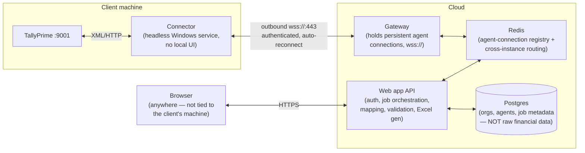

# Target architecture (decided)

Companion to [zoho-migration-tool-review.md](zoho-migration-tool-review.md), which documents the manual process we're replacing, [deployment-plan.md](deployment-plan.md), which turns the phases below into an actual dev → staging → production build order on AWS, and [connector-bridge-setup-guide.md](connector-bridge-setup-guide.md), the step-by-step guide to actually standing this up locally.

**Revision note:** an earlier version of this doc decided on a *local-first* design (hosted panel UI, but the browser called the connector directly over `localhost`, so the connector never needed to accept inbound traffic). That's been superseded — the requirement is now for the web application to be the single, central place a user interacts with, reachable from anywhere, with the connector as a headless background agent and no local UI at all. That requires a cloud tunnel. This doc now records that decision. The local-first design is kept at the bottom for reference, since it's a legitimate fallback if the tunnel's operational cost ever isn't worth it.

**Scope for v1 (decided, unchanged):** automate everything up to a validated, Zoho-Books-import-ready Excel/CSV file the user downloads. The final manual CSV import into Zoho Books and the closing-balance check stay human steps — but everything before that (Tally export settings, JDK install, file copying, running a silent batch job, hand-auditing an integrity CSV) becomes one flow in the web application. Direct Zoho Books API push is still out of scope for v1.

**Scope decision (extraction only, no writes):** this service reads data out of Tally — masters and vouchers — and never writes to it. An early `POST /tally/ledgers` (create-a-ledger write) existed briefly and was removed once the scope was made explicit; every action a connector can be asked to perform (`TUNNEL_ACTIONS` in [tunnel-protocol.ts](../src/tunnel/tunnel-protocol.ts)) is a Tally export/report request. If a write-back path (e.g. posting mapped vouchers into Tally) is ever wanted, that's a deliberate, separate decision — not something to grow this API into by accident.

---

## Components

The connector reuses the existing `TallyModule` almost unchanged (`EnvelopeBuilder` → `TallyConnector` → `TallyResponseParser` → typed JSON) — that's exactly why it was built as a self-contained module in Phase 1. `TallyConnector` is an interface (`TallyHttpClient` is its only implementation today) so extraction logic never depends on HTTP details directly. The per-entity Tally calls themselves live in three small services under `src/tally/extraction` — `MasterExtractionService` (Companies/Ledgers/Groups/Stock Items), `TransactionExtractionService` (Vouchers), plus `TallyDiagnosticsService` for the connectivity probe and the raw-report escape hatch — all sharing one base class for audit logging, company resolution, and caching. What changes for the agent is the transport it's driven by: instead of exposing these as local HTTP endpoints for a browser, it becomes a command handler that receives "run this extraction" messages over the tunnel and streams typed JSON results back. No mapping, validation, or Excel logic runs on the client machine at all.

## The two decisions this design is built around

1. **Processing happens in the cloud, not on the agent.** The agent only extracts and forwards typed Tally data (companies/ledgers/vouchers/etc., using the parser already built and tested). Mapping rules, validation, and Excel generation live in the API layer. This means a mapping-rule fix ships instantly to every client with zero agent redeployment — the tradeoff is that raw financial data does transit your infrastructure in-flight.
2. **That data is transient, not persisted.** Extracted records exist in memory/stream for the duration of a job, get turned into the output file, and are discarded. What *is* persisted is job **metadata** — org, agent, company, which entity types were requested, record counts, validation-issue counts, status, timestamps (this is exactly what `ExtractionJob` already models). The generated Excel file itself should live in short-TTL storage (e.g. object storage with a lifecycle rule, or streamed straight through without touching disk) — not kept indefinitely. If "re-download without re-extracting" turns out to be a real need later, that's a deliberate follow-up decision (it reopens retention/compliance questions), not a default.

## Non-negotiables for this architecture

**Connectivity & resilience**
- `wss://` on port 443 with configurable outbound proxy support — client networks routinely block non-standard ports and force traffic through an authenticated forward proxy.
- Reconnect with backoff; "agent offline" is a normal, frequent state (sleep, reboot, WiFi drop), not an error condition.
- Three independent status signals surfaced to the web app, not conflated: **agent online** (tunnel up) / **Tally reachable** (agent can hit :9001) / **company loaded** (target company open in Tally). Each fails differently and needs a different fix.
- Jobs, not request/response — an extraction crossing a network hop needs to survive a tunnel drop mid-job (clean failure + resumability), and the browser needs push/poll status rather than holding an HTTP connection open across a whole extraction.

**Multi-tenancy & routing**
- A given agent's socket lives in one gateway instance's memory; scaling the gateway horizontally requires a shared registry (Redis) so any API instance can find and route to the right gateway instance. This is not optional once there's more than one gateway process — not yet needed at current scale (see [deployment-plan.md](deployment-plan.md) §2), but the registry piece below is already built the right way for it.
- `TallyConnection` is the real agent registry: org → agent → live status → paired company (`defaultCompany`), backed by Postgres via `DatabaseModule`/`PrismaService` (both real, not stubs). `ExtractionJob`'s repository is a real Prisma-backed audit trail (`extractionJobRepositoryProvider` in [tally.module.ts](../src/tally/tally.module.ts)) — every extraction call, direct or via the tunnel, gets an audit row.

**Security — the threat model changed**
- Local-first's threat model was "another browser tab on the same PC." This one's threat model is the public internet. Agents authenticate with a per-install device credential issued at download/pairing time and scoped to one org — never a bare origin check.
- Least privilege: an agent can only ever act on the org/company it's paired to. `ExtractionsService` enforces this for the job API: an explicit `payload.company` must match the connection's paired `defaultCompany` (or the connection must have none configured). Learned the hard way once — an early Phase 1-2 proof-of-concept endpoint (`GatewayController`) let any authenticated user list or drive *any* org's connected agent with no org check at all; it was removed once the real, org-scoped job API (`ConnectionsModule`/`ExtractionsModule`) superseded it.
- Revocation: killing one compromised/lost agent's access must not require a redeploy.
- Per-agent rate limiting, TLS everywhere including the tunnel itself.

**Versioning**
- The agent now lives on client machines you don't control day-to-day. It must report its version on connect; the gateway should flag or block outdated agents rather than silently running stale mapping logic.

## Phased build plan

### Phase 1 — Agent tunnel client ✅ done
The connector's local HTTP controller was replaced with a tunnel client (`AgentTunnelClient`): connects outbound to the gateway, authenticates, and handles "extract X for company Y" commands by driving the same `MasterExtractionService`/`TransactionExtractionService`/`TallyDiagnosticsService` the direct `/tally/*` endpoints use, streaming results back over the socket. Reconnect/backoff (unit-tested), version reporting on connect. Outbound proxy support is not yet built.

### Phase 2 — Gateway service ✅ done (single-instance)
`TallyTunnelGateway` terminates agent WebSocket connections, authenticates them (Phase 3's device tokens), and routes commands to the right agent by connection id. Runs in the same process as the rest of the app for v1 (see [deployment-plan.md](deployment-plan.md) §2) — the Redis-backed cross-instance routing described above isn't needed until there's more than one gateway process.

### Phase 3 — Agent registry & pairing ✅ done
`TallyConnection` is real: per-org device credentials (`ConnectionsService.create`, shown once), pairing token verified by the gateway on `hello`, revocation (`POST /connections/:id/revoke`, closes any live socket immediately), live status tracked via the gateway's in-memory registry cross-referenced in `GET /connections`.

### Phase 4 — Job orchestration ✅ done
`ExtractionJob` is real, backed by **BullMQ** on the existing Redis instance: async job lifecycle (`POST /extractions` / `POST /extractions/fetch-master` → `GET /extractions/:id` for status → `GET /extractions/:id/result`), short-TTL Redis storage for the result (no persistence of raw extracted records — see the two decisions above), retried with exponential backoff on failure (safe because every job is a read — see the extraction-only scope decision), and only marked FAILED once retries are exhausted. On completion (success or final failure), a **Nodemailer**-based notification goes out rather than requiring the user to keep a tab open and watch.

### Phase 5 — Master & transaction data breadth (in progress)
Scope is the authoritative 33-function list in [tally-zoho-function-mapping.md](tally-zoho-function-mapping.md) (from the project's own Tally↔Zoho mapping reference, not inferred from the Zoho migration tool's config). Modeled end-to-end today: Companies (#1), Ledgers (#2/#7/#8) — enriched with GSTIN/PAN/contact/address/bank fields, see Phase 7 — Groups (#4), Stock Items (#9, enriched with HSN/GST rate), Cost Centres (#13), and Vouchers (#14-24/#30-33, filterable by voucher type, enriched with party GSTIN/place of supply). The remaining masters (Stock Groups, Stock Categories, Godowns, Tax, Currencies) and the two-Zoho-targets-from-one-Tally-voucher-type cases (#18/#22, #19/#21) are still open — mechanical per-entity, same builder/parser/interface pattern as the existing implementations, added one at a time as actually needed rather than speculatively. Tax/Currencies specifically also have no template in `Master and Invoice or Bill/` (see Phase 7) — out of scope until one exists.

### Phase 6 — Mapping & validation engine (mapping done, validation not started)
Per-entity mapping rules exist and are unit-tested for all 9 export-ready entities (`src/mapping/*.mapper.ts` — LedgerMapper/CustomerMapper/VendorMapper/StockItemMapper/CostCentreMapper/InvoiceMapper/BillMapper/CreditNoteMapper/StockJournalMapper). Several are documented simplifications rather than the reference tool's full accounting-edge-case logic — e.g. GST Treatment is derived from GSTIN presence alone (no composition-scheme/overseas detection), and Invoice/Bill/Credit Note tax is a single derived value (no seller-home-state config exists yet to distinguish intra vs. inter-state/IGST). The `Integrity.csv`-equivalent structured validation results shown inline before download are not built.

### Phase 7 — Excel writer ✅ done for the 9 templates with a matching Zoho file
`ExcelGeneratorService.writeIntoTemplate` (`src/excel/excel-generator.service.ts`) loads the REAL Zoho template file (copied into `src/mapping/templates/` from the project root's `Master and Invoice or Bill/`, shipped via `nest-cli.json`'s asset copy and `package.json`'s `pkg.assets`), clears every existing row below the header — the templates ship with 3-13 rows of Zoho's own demo data that must never reach a real download — and writes mapped rows in by real header text, never touching column definitions/formatting. `src/mapping/zoho-entity.map.ts` is the single registry of entity → template file → sheet name, validated at boot by `ZohoTemplateValidatorService` so a moved/renamed template fails at startup, not on first export. `ExtractionsService.getExcelResult` is the dispatch point (`GET /extractions/:id/excel`, `?groupsJobId=`/`?ledgerEntity=`/`?itemsJobId=` as needed per entity).

### Phase 8 — Web app UI (in progress)
React + Vite frontend (`frontend/src`), tab-based (no router yet): Connections, Device Pairing, Tally Direct, Extractions. `ExtractionsPanel` covers the extraction flow — company picker, fetch-master form, 2s status polling, and a **server-backed job list** (`GET /extractions`, added alongside `ExtractionsService.listJobs` specifically so the UI never needs a user to paste a job id) with an inline "Download" per completed job. Excel export needs no manual companion-job id either: `GET /extractions/:id/excel` auto-resolves LEDGERS' GROUPS job and VOUCHERS' STOCK_ITEMS job to the most recent successful match for the same company (`ExtractionsService.resolveLatestSuccessfulJobId`) — caught live: requiring users to manually look up and paste a second job's UUID to download was exactly the kind of friction the job-queue abstraction was supposed to remove. Inline validation warnings and a WebSocket-based (vs. polling) progress subscription are still open.

---

## Appendix: the superseded local-first design

Kept for reference — this is the simpler fallback if a full tunnel infrastructure ever isn't worth the operational cost (no gateway, no Redis routing, no device-credential system, no ephemeral-storage/retention questions, data never leaves the client machine). It assumed the operator's browser was always on the same machine as the connector (present or remoted in), so the panel UI could call `localhost:3000` directly with no inbound tunnel needed — just CORS-origin-locking, a Private Network Access response header, and a local pairing token. Superseded because the requirement is now remote access from anywhere, not just from the client's machine.
